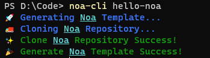

# Noa CLI



# Install

```bash
npm install --global noa-cli
```

# Local install

```bash
git clone https://github.com/noa-js/noa-cli
```

```bash
cd noa-cli
```

```bash
npm install --global
```

# Help

```
Usage: noa-cli [options] <project-name>

Arguments:
  project-name   project name

Options:
  -V, --version  output the version number
  -h, --help     display help for command
```
